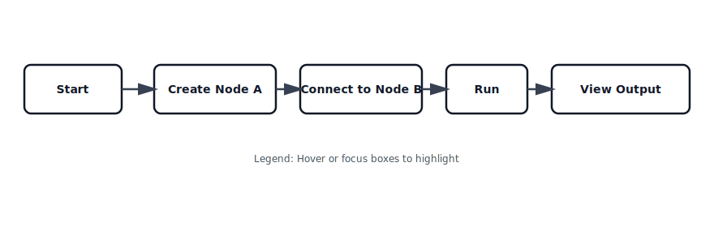

# Quickstart

Get Hyperflow Editor running in minutes using Docker.

## Prerequisites
- Docker & Docker Compose
- (Optional) Node.js 20+ for local development

## Setup with Docker (Recommended)

1. **Clone the repository**
   ```bash
   git clone <your-repo-url>
   cd hyperflow-editor
   ```

2. **Run with Docker Compose**
   The project includes a `docker-compose.yml` that sets up the application and connects it to the existing HyperCode network infrastructure.
   ```bash
   docker compose up -d --build
   ```

3. **Access the Application**
   Open your browser to [http://localhost:3002](http://localhost:3002).

## Local Development Setup

If you prefer to run locally without Docker:

1. **Install dependencies**
   ```bash
   npm install
   ```

2. **Configure Environment**
   Copy `.env.example` to `.env.local` and configure your database and Supabase credentials.

3. **Run Development Server**
   ```bash
   npm run dev
   ```
   Access at [http://localhost:3000](http://localhost:3000).

## First Flow
- Open the editor and create a simple node connection
- Toggle Zen Mode to reduce visual noise
- Check Version History and try a safe restore

### Visual
<figure>
  
  <figcaption>Quickstart sequence: create nodes, connect, run, and view output.</figcaption>
</figure>
